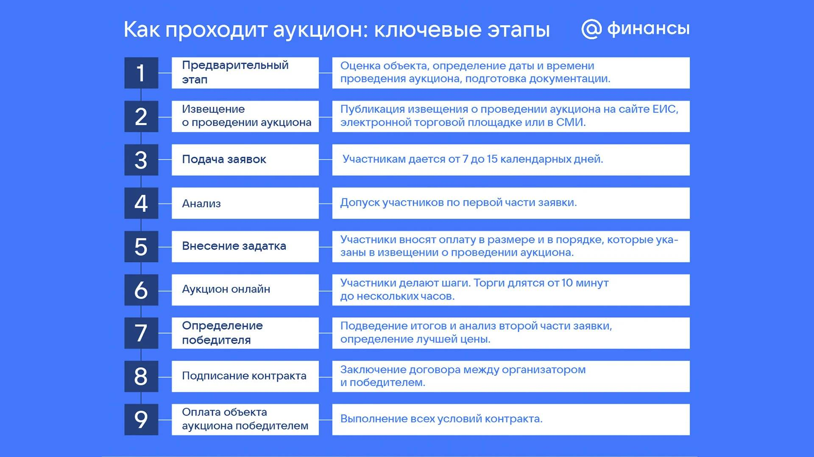

---
## Front matter
lang: ru-RU
title: Доклад
subtitle: Аукцион с повышением цены
author:
  - Дурдалыев М.
institute:
  - Преподаватель - Кулябов Д. С.
  - Российский университет дружбы народов, Москва, Россия
date: 02 мая 2025

## i18n babel
babel-lang: russian
babel-otherlangs: english

## Formatting pdf
toc: false
toc-title: Содержание
slide_level: 2
aspectratio: 169
section-titles: true
theme: metropolis
header-includes:
 - \metroset{progressbar=frametitle,sectionpage=progressbar,numbering=fraction}
 - '\makeatletter'
 - '\beamer@ignorenonframefalse'
 - '\makeatother'
---

# Информация

## Докладчик

:::::::::::::: {.columns align=center}
::: {.column width="70%"}

  * Дурдалыев Максат
  * студент
  * Российский университет дружбы народов
  * [1032205337@pfur.ru](mailto:1032205337@pfur.ru)
  * <https://mdurdalyyev.github.io/ru/>

:::
::: {.column width="25%"}

:::
::::::::::::::

# Вводная часть

# Вводная часть

## Эпиграф

> "Аукцион — это битва не за цену, а за желание."  
> $\qquad\qquad\qquad\qquad\qquad$ <cite>неизвестный автор</cite>

## Цели и задачи

**Цель**

Исследовать механизм аукциона с повышением цены, его особенности, стратегии участников и области применения.

**Задачи**

* Дать определение аукциону с повышением цены;
* Рассмотреть правила и динамику торгов;
* Привести примеры практического применения;
* Проанализировать стратегии участников.

## Актуальность

Аукционы с повышением цены широко применяются в экономике, искусстве, недвижимости, онлайн-торгах. Понимание принципов их работы важно для эффективного участия, оптимизации прибыли и изучения рыночного поведения.

# Основы теории аукционов

Аукцион — способ продажи товаров или услуг, при котором цена определяется в процессе состязания между покупателями.

## Классификация аукционов

|Тип аукциона             |Описание                                        |
|------------------------|------------------------------------------------|
|С повышением цены (английский) | Побеждает участник, предложивший наибольшую цену. Торги ведутся вверх. |
|С понижением цены (голландский)| Начинают с высокой цены, которая снижается до первого согласия. |
|Закрытый (первичный)     | Участники делают ставки одновременно.         |
|Закрытый (вторичный)     | Побеждает наивысшая ставка, но платится вторая. |

# Аукцион с повышением цены

## Механизм

- Начальная цена объявляется организатором.
- Участники делают ставки, повышая цену.
- Торги продолжаются, пока остаётся один участник.
- Он и становится победителем, заплатив свою ставку.

## Иллюстрация

{width=70%}

# Исторический пример

**Аукционный дом Sotheby’s**  
Основан в 1744 году, проводит торги по английскому типу. Пример — продажа картины Бэнкси «Love is in the Bin» в 2021 году за $25,4 млн.

# Математическая модель

Пусть:

- $n$ — число участников,
- $v_i$ — оценка товара $i$-м участником,
- $b_i$ — ставка участника.

**Оптимальная стратегия:**  
Участвовать, пока текущая ставка < $v_i$.  
Выходить из торгов, когда цена ≥ $v_i$.

# Пример аукциона

Участники: Аня ($v=100$), Борис ($v=80$), Вера ($v=60$)  
Ход торгов:

1. Стартовая цена — 50  
2. Вера выходит при 60  
3. Борис выходит при 80  
4. Аня побеждает, платит 80

**Результат:** Аня получает товар, платит меньше своей оценки.

# Практическое применение

|Область           |Примеры                             |
|------------------|-------------------------------------|
|Искусство         |Продажа антиквариата, картин         |
|Онлайн-аукционы   |eBay, Avito                          |
|Госзакупки        |Поставки оборудования, контрактов    |
|Реклама           |Google Ads, система ставок за показ  |

# Выводы

Аукцион с повышением цены — эффективный рыночный механизм, учитывающий ценность товара для участников и стимулирующий конкуренцию. Он прозрачен, понятен и широко применим.

# Список литературы

1. Крэмер Г. Теория аукционов. — М.: Логос, 2020.  
2. Milgrom P. Auction Theory for Beginners. 2017.  
3. Википедия: Аукцион с повышением цены. URL: https://ru.wikipedia.org/wiki/Аукцион
